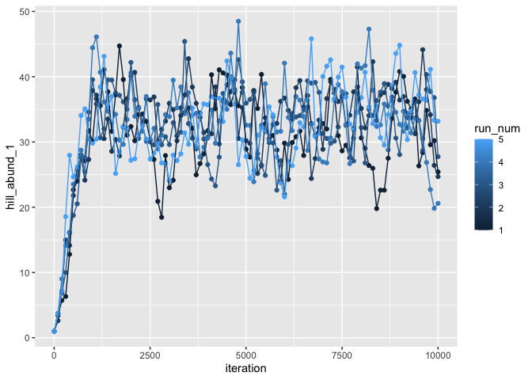
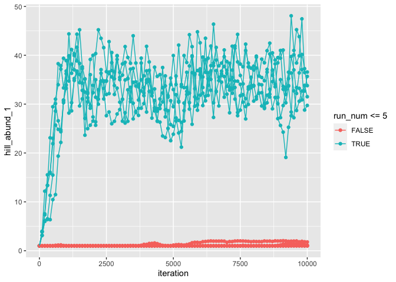
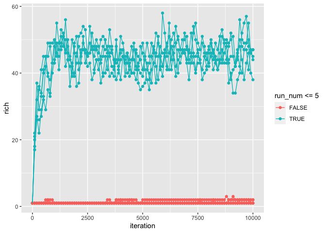
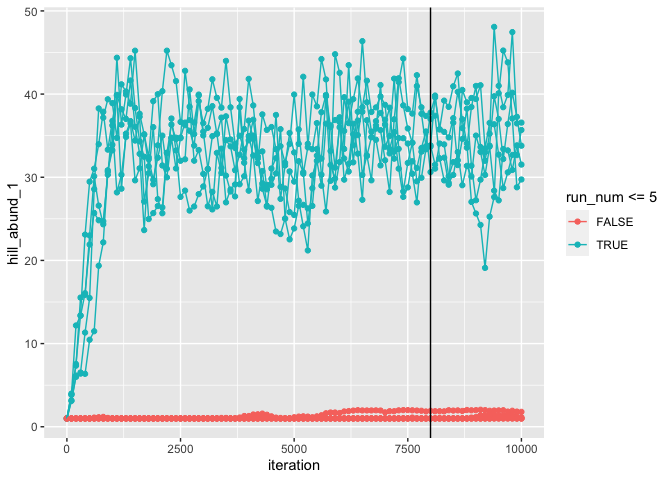
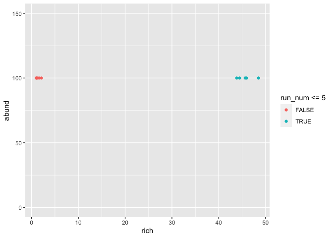
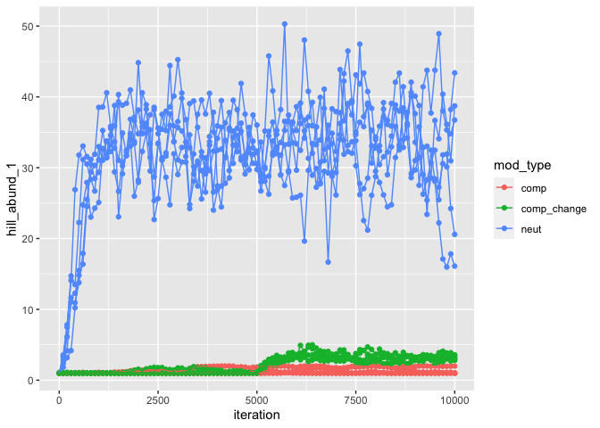
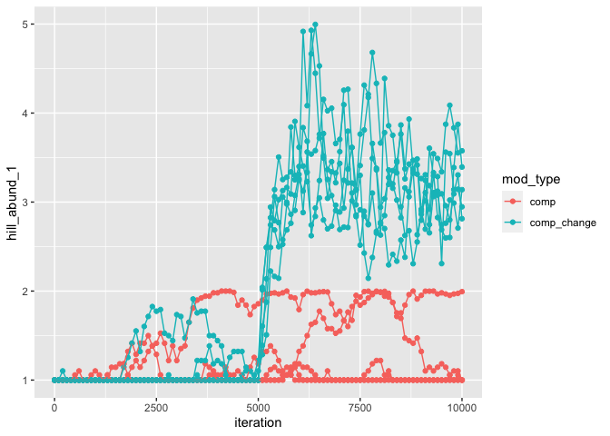
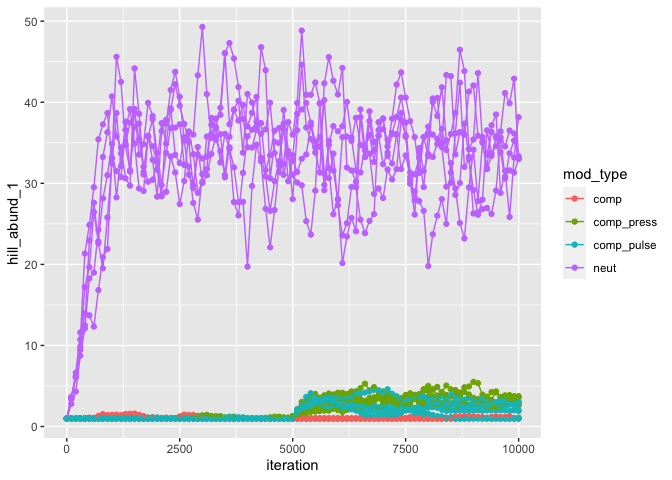
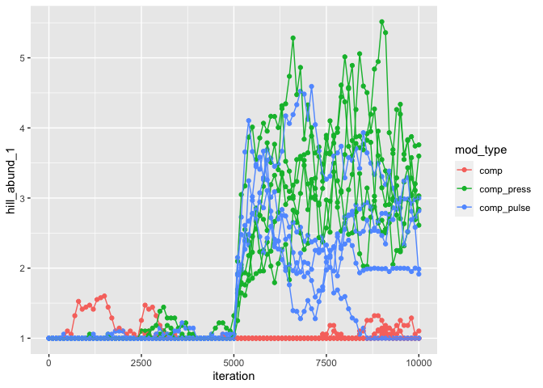

roleExperiments
================

``` r
library(roleR)
library(ggplot2)
library(dplyr)
```

    ## 
    ## Attaching package: 'dplyr'

    ## The following objects are masked from 'package:stats':
    ## 
    ##     filter, lag

    ## The following objects are masked from 'package:base':
    ## 
    ##     intersect, setdiff, setequal, union

``` r
set.seed(3) #jbp
### Setting up a roleExperiment

#### Replicates of the same parameter settings

params1 <- untbParams(individuals_local = 100, individuals_meta = 1000, 
                      species_meta = 50, 
                      speciation = 0.2, 
                      dispersal_prob = 0.1, init_type = 'oceanic_island',
                      niter = 10000, niterTimestep = 100) 

paramsList1 <- list(a= params1, b= params1, c=params1, d= params1, e=params1)

trial1 <- roleExperiment(paramsList1)

results1 <- runRole(trial1)

results1@modelRuns[[1]]@modelSteps[[10]]@localComm@indSpecies
```

    ##   [1] 170   1  10 106 190  81 191 167 130  97  12 206 188  80 130   6  10 166
    ##  [19] 199   5 163   1 207   1   6 210   6 106 147  80 203   1  12 192 169  19
    ##  [37] 184  97   1  12 163   1 202   4   6   6   6 130 170  12   2 160   6 159
    ##  [55]   1 166   2 190  81  80 197 191 200 167  12 167   6 147 163 197 205  19
    ##  [73]   1   1 147 179 190 195 159 190   4 130  12 179 208 206 160  74  97 190
    ##  [91]   1 190   4  19 184 209  74 117  80   1

``` r
sumStats1 <- getSumStats(results1, funs =  list(rich = richness,
                                                hill_abund= hillAbund,
                                                abund = totalN))


ggplot(sumStats1, aes(iteration, hill_abund_1, group = run_num, color = run_num)) +
    geom_point() +
    geom_line()
```

<!-- -->

``` r
#### This is beautiful ^^^^


#### With different param settings

set.seed(3)

params2 <- roleParams(individuals_local = 100, individuals_meta = 1000, 
                      niter = 10000, niterTimestep = 100, neut_delta = 0, comp_sigma = .05, dispersal_prob = .001) 

paramsList2 <- list(params1, params1, params1, params1, params1, params2, params2, params2, params2, params2)

trial2 <- roleExperiment(paramsList2)

results2 <- runRole(trial2)

results2@modelRuns[[1]]@modelSteps[[10]]@localComm@indSpecies
```

    ##   [1]  75 228 143 129   8 211   5 223 222   2  18 223  24  38 211   8 203   2
    ##  [19] 223  18 203  38 145 129 237 228 224 236  18   1 214 129  15 129   8   2
    ##  [37]   5  15  76 203 207   2 201   8  76 145 230  76   8 145 129  15 210   3
    ##  [55] 123  76 232 201   1   7 228 216 125 214  75 238 145 181 145 214 170  87
    ##  [73] 170 203 223 123  75  76 203  76   8   2 220 187 140   2 143 220 230  76
    ##  [91] 129   8   2 204 235 204  76   1 233 197

``` r
sumStats2 <- getSumStats(results2, funs =  list(rich = richness,
                                                hill_abund= hillAbund,
                                                abund = totalN))


ggplot(sumStats2, aes(iteration, hill_abund_1, group = run_num, color = run_num <= 5)) +
    geom_point() +
    geom_line()
```

<!-- -->

``` r
ggplot(sumStats2, aes(iteration, rich, group = run_num, color = run_num <= 5)) +
    geom_point() +
    geom_line()
```

<!-- -->

``` r
# ggplot(sumStats2, aes(rich, abund, color = run_num <= 5)) +
#     geom_point() +
#     ylim(0, 150)

### Rough argument for equilib.


ggplot(sumStats2, aes(iteration, hill_abund_1, group = run_num, color = run_num <= 5)) +
    geom_point() +
    geom_line() +
    geom_vline(xintercept = 8000)
```

<!-- -->

``` r
sumStats2_equilib_mean <- sumStats2 %>%
    filter(iteration >8000) %>%
    group_by(run_num) %>%
    summarize_at(vars(rich, abund, hill_abund_1), .funs = mean)

ggplot(sumStats2_equilib_mean, aes(rich, abund, color = run_num <= 5)) +
    geom_point() +
    ylim(0, 150)
```

<!-- -->

``` r
#### Ok, for the win, let's try iter functions
set.seed(6)
params3 <-  roleParams(individuals_local = 100, individuals_meta = 1000, 
                          niter = 10000, niterTimestep = 100, neut_delta = 0, 
                       comp_sigma = .05, dispersal_prob = function(iter){return(ifelse(iter < 5000, .001, .25))}) 


paramsList3 <- list(params1, params1, params1, params1, params1, params2, params2, params2, params2, params2,
                    params3, params3, params3, params3, params3)

trial3 <- roleExperiment(paramsList3)

results3 <- runRole(trial3)

results3@modelRuns[[1]]@modelSteps[[10]]@localComm@indSpecies
```

    ##   [1] 174 146   1   1   8   1   9 161   2   9   2 200 174   8 205 202 192 165
    ##  [19]   1  16  97  12 187 201  11  92  25   1 176   1   1 169  47 169   2 160
    ##  [37] 131  12 208 132 127 203  10  92   1 204   6   1 160  25  92 169  92 187
    ##  [55]  19  92 146   2  16 190 194   2   2   2  92 192   2 187 206 127  12  47
    ##  [73]   1  16 185 127  86   4  16 169  86 207   2  97  12   4 132  47  86 129
    ##  [91]  12  86   3 198 129   2  92 127 127 209

``` r
sumStats3 <- getSumStats(results3, funs =  list(rich = richness,
                                                hill_abund= hillAbund,
                                                abund = totalN)) %>%
    mutate(mod_type = ifelse(run_num %in% c(1:5), "neut", ifelse(run_num %in% 6:10, "comp", "comp_change")))


ggplot(sumStats3, aes(iteration, hill_abund_1, group = run_num, color =mod_type)) +
    geom_point() +
    geom_line()
```

<!-- -->

``` r
ggplot(filter(sumStats3, mod_type != "neut"), aes(iteration, hill_abund_1, group = run_num, color =mod_type)) +
    geom_point() +
    geom_line()
```

<!-- -->

``` r
#### Iter fun to introduce pulse perturbation


params4 <-  roleParams(individuals_local = 100, individuals_meta = 1000, 
                       niter = 10000, niterTimestep = 100, neut_delta = 0, 
                       comp_sigma = .05, dispersal_prob = function(iter){return(ifelse(iter < 5000, .001, ifelse(iter < 6000, .25, .001)))}) 


paramsList4 <- list(params1, params1, params1, params1, params1, params2, params2, params2, params2, params2,
                    params3, params3, params3, params3, params3, params4, params4, params4, params4, params4)

trial4 <- roleExperiment(paramsList4)

results4 <- runRole(trial4)

results4@modelRuns[[1]]@modelSteps[[10]]@localComm@indSpecies
```

    ##   [1]  15  15 203   3 125 158 171 198 139 194   6  15 139 162   6 159 177 194
    ##  [19] 159 159 171 110 158  15   6 182  15 177 125 158 139  78 125 166 203 125
    ##  [37] 125 158 194  86   5 177 196   6   5 110 200   6 211   5 149 149 191 131
    ##  [55]  15 149 208  15  15 158 213 186  55  15 206 201 207 158 139   6 125 202
    ##  [73] 139 196 159 131 125 194 194 199  15 205 158 187 195 177 188 162   2  86
    ##  [91]  86 139 164 166 212   3 193 125   5 210

``` r
sumStats4 <- getSumStats(results4, funs =  list(rich = richness,
                                                hill_abund= hillAbund,
                                                abund = totalN)) %>%
    mutate(mod_type = ifelse(run_num %in% c(1:5), "neut", ifelse(run_num %in% 6:10, "comp", ifelse(run_num %in% 11:15, "comp_press", "comp_pulse"))))


ggplot(sumStats4, aes(iteration, hill_abund_1, group = run_num, color =mod_type)) +
    geom_point() +
    geom_line()
```

<!-- -->

``` r
ggplot(filter(sumStats4, mod_type != "neut"), aes(iteration, hill_abund_1, group = run_num, color =mod_type)) +
    geom_point() +
    geom_line()
```

<!-- -->
